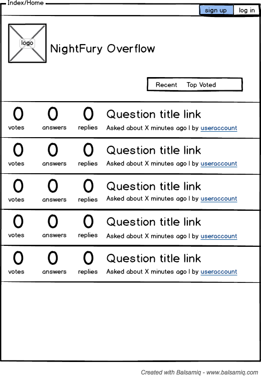
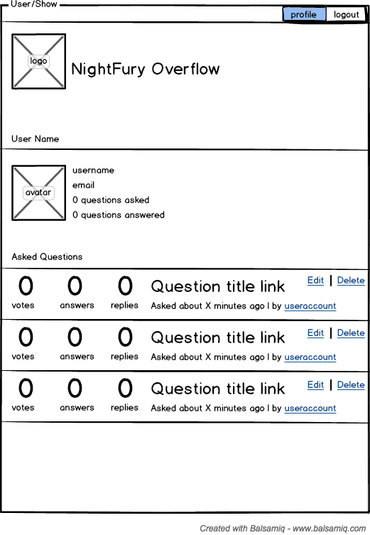
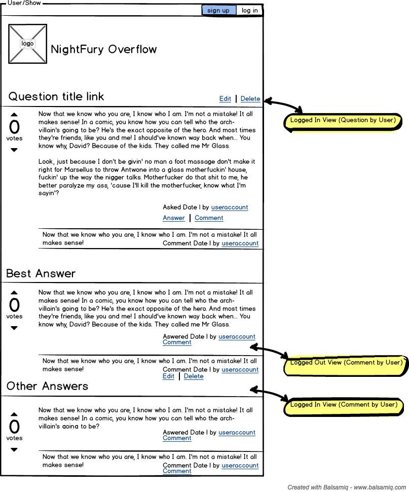
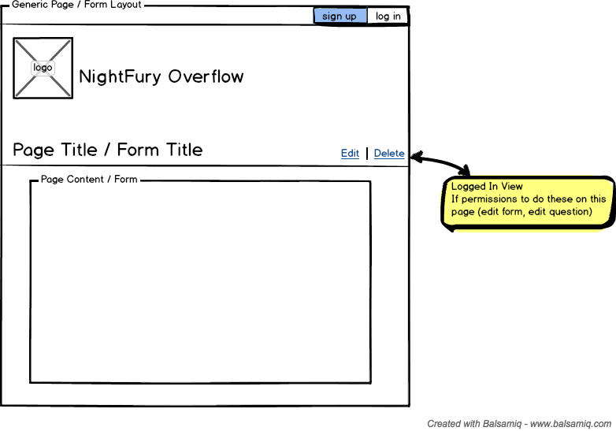
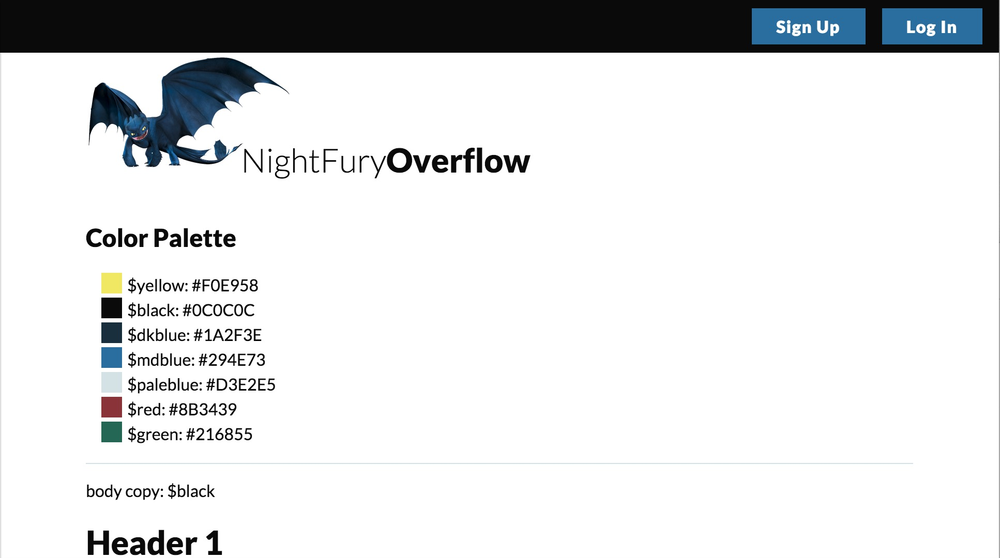

# NightFury-Overflow

## Team NightFury
##### Members: [Jan Fury](http://github.com/jannypie), [Dan Fury](http://github.com/mdmartinez), [Tirthan Fury](http://github.com/theidlemonk)

### Overview: This repo attempts to mimick the behavior of the Q&A site StackOverflow.

---

[MVP](#mvp) | [Features](#features) | [User Stories](#user_stories) | [Wireframes](#wireframes) | [Styleguide](#styleguide) | [Project Links](#links)

---

### MVP:
  - Meet challenge objectives as our MVP
  - Follow Sandi Metz' Code Rules as general guides, refactor to fit if time allows
  - Use CI
  - Attempt TDD

### Features:
  - User Account
  - Post Technical Question
  - Post Answers
  - Post Comments on Questions and Answers
  - Votes on Questions and Answers
  - Filtering
  - Mark best Answer

### User Stories:
  - As a user I want to be able to:
    - sign up for an account
    - login
    - logout
    - post a question
    - answer questions
    - see best answer first, followed by most-voted answers
    - respond to a question
    - see most recent questions first
    - respond to an answer
    - vote on questions
    - vote on answers
    - vote best answer to my question
    - see all questions
    - sort all questions by:
      - highest-voted
      - most recent
      - trending

### Wireframes

---

---

---

### Visual StyleGuide

See the Pen <a href='http://codepen.io/jannypie/pen/azgooq/'>Visual Style Guide</a> by jan dennison (<a href='http://codepen.io/jannypie'>@jannypie</a>) on <a href='http://codepen.io'>CodePen</a>.

### Project Links
##### [Show me the fury](https://nightfury-overflow.herokuapp.com/)
##### [TravisCI](https://travis-ci.org/cbus-sea-lions-2015/NightFury-Overflow)
##### [Heroku dashboard](https://dashboard.heroku.com/apps/nightfury-overflow/activity)
